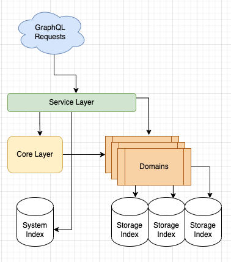

## SimpleSchema Software Architecture

The simple schema solution is a multi-modules software project build upon different architecture layers.

The fundamental idea behind this structure is the abstraction and compartmentalization of different software and functional
concerns.

The project is bounded as a multi-modules gradle project which includes main core module and additional service utilities modules dedicated 
to enable functionality with opensearch storage layer.

-------------
 
The software building block in this project use many familiar and reliable open source libraries:

#### Software General purpose libraries
 - Apache guice   - https://github.com/google/guice
 - Apache logging - https://logging.apache.org/log4j/2.x/
 - javaslang -      https://github.com/vavr-io/vavr
 - jackson   -      https://github.com/FasterXML/jackson
 
#### Graph libraries
 - GraphQL Java  - https://github.com/graphql-java/graphql-java

#### Indexing store libraries
 - opensearch - https://github.com/elastic/opensearch
 
-------------

## Architecture
As in many complex software components, the engineering approach for development of this engine is based on the following
concepts and patterns:

- Single Responsibility
- Separation of concerns
- Design to Interface
- Clear definition of domain boundaries
- Implement Model View Control paradigm [MVC](https://martinfowler.com/eaaDev/uiArchs.html)

These concepts and many others help reduce complexity and keep the code focus as possible on the real inherent complexities.

### Plugin Architecture
The project is developed with the Plugin-Architecture in mind, this concept is focused on the next elements
- Extendability - Easily extend functionality by simply adding a new plugin
- Configurability - Change basic behavior by replacing plugin or changing plugin loading configuration
- Dependency Injection - Allow for plugins to be depended on one another using Dependency Injection

These capabilities are a root concept of many open source extensible projects (opensearch for example) and makes use of
google guice dependency injections platform [Guice](https://github.com/google/guice)

### Modules and structure

The project is a monolith composed of multiple modules (components). The project uses gradle .

There are **3 conceptual layers** of modules that the project is composed of:
- **Core layer** - which the main entities, models, transformation compilers and factories are defined
- **Service layer** - which compose these two layers and defines the **Model View Control** access to the API
- **Domain layer** -  which contains the domain specific modules including specific configuration and add-ons

The project structure is designed with the purpose of adding plugin as free as possible - hence the term pluggable architecture.
For this to be possible an effort was made to modularize the functional parts of the software to allow clear and direct extensibility.

### The Core Layer
Here the main generic entities and models are defined, the default behavior and functionality and the engine's core fundamental parts.

The core modules:
 - **core** :  
   - representing the data model elements (classes) used to query, profile, analyze, process and project the data.     
   - containing the Abstract Syntax's GQL Schema/Query Visitors that are responsible for transforming & rewriting the GQL schema.      
   - containing the core functionality common to all generic parts such as Schema Transformations, Schema provider, Drivers and more     

This is a library module that will be deployed independently to maven and will be used by other plugins such as the Knowledge-Graph.
See [Knowledge Graph](https://github.com/opensearch-project/knowledge-graph)

### The Service Layer

The Service Layer is the module which is responsible for running the Simple Schema Engine as a plugin in [opensearch](https://github.com/opensearch-project)
- **services**  :
  - containing the services & controllers wrapping the Web endpoints and delivering traceability and logging
  - responsible for the opensearch-plugin related elements and interaction with its components 

### The Domain Layer

The Domain Layer is the part which is responsible for running the different schemas that are alive during the operational part
- **domain**  :
  - containing the user related domain schema including its specific queries, subscriptions and mapping
  - responsible for the query validation and transformation from the logical GQL query to a specific supported language   

